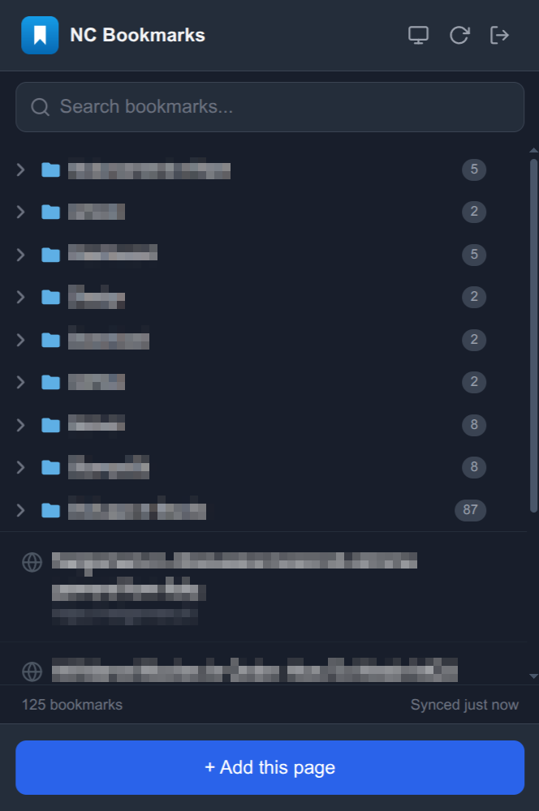
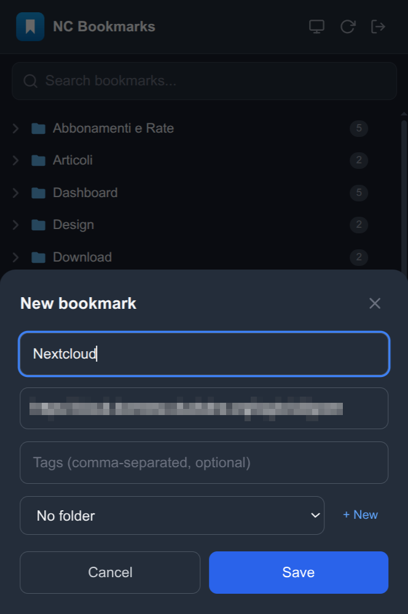
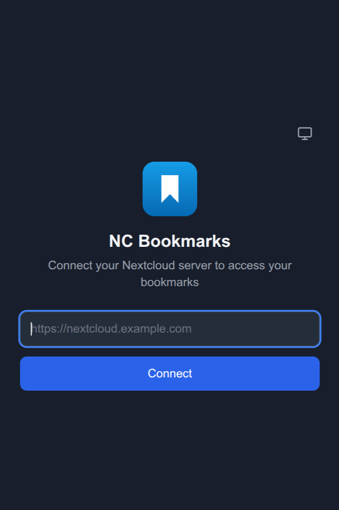

# NC Bookmarks — Nextcloud Bookmarks Client

[](https://github.com/domresc/nc-bookmarks-client/actions/workflows/ci.yml)
[](LICENSE)

Chrome/Chromium extension (Manifest V3) acting as a client for the [Nextcloud Bookmarks](https://apps.nextcloud.com/apps/bookmarks) app. Fast search, one-click bookmarking of the current tab, full folder management, automatic sync and light/dark theme.

## Screenshots

| Bookmark list | Quick add | Setup |
|---------------|-----------|-------|
|  |  |  |

## Features

- **Automatic login** — enter only your server URL and sign in via Nextcloud Login Flow v2 (no password typed into the extension)
- **Instant search** — case-insensitive filter on title, URL, tags and folder names, 300 ms debounce, highlighted matches
- **Quick add** — "+ Add this page" prefills title and URL from the active tab
- **Edit & delete** — per-bookmark dropdown menu with edit modal and delete confirmation
- **Folder management** — nested folders shown as a tree; create (also at add-time), rename and delete folders from the UI
- **Favicons** — fetched through the Nextcloud Bookmarks API and cached locally for 7 days (no per-open request storm)
- **Sync** — manual button + automatic background refresh when the cache is older than 5 minutes
- **Light/dark theme** — three-state toggle (light → dark → auto) with `prefers-color-scheme` detection
- **Local cache** — the popup always reads from `chrome.storage.local` for maximum speed
- **Minimal permissions** — only `storage`, `activeTab` and `alarms`; server access is requested at setup time

## Build

```bash
npm install          # install dependencies
npm run build        # typecheck + production build into dist/
npm run typecheck    # tsc --noEmit only
npm run watch        # development mode with automatic rebuild
npm run clean        # remove dist/
```

## Installation in Chrome

The extension is not published on the Chrome Web Store: it is distributed through this repository only.

**From a release (recommended)** — download the `.zip` from the [Releases page](https://github.com/domresc/nc-bookmarks-client/releases/latest) and extract it, then:

1. Go to `chrome://extensions`
2. Enable **"Developer mode"** (top-right corner)
3. Click **"Load unpacked"**
4. Select the extracted folder

**From source** — run `npm install && npm run build` (see [Build](#build)) and select the project's `dist/` folder at step 4.

The extension appears in the toolbar. On first click the setup screen opens.

## Project structure

```
nc-bookmarks-client/
├── manifest.json                # MV3 — permissions, service worker, icons
├── package.json                 # Webpack 5 + React 18 + TailwindCSS v4
├── tsconfig.json                # TypeScript strict, JSX react-jsx
├── webpack.config.js            # Two entries: popup + service-worker
├── postcss.config.js            # @tailwindcss/postcss + autoprefixer
├── public/icons/                # Extension icons (16/32/48/128px)
├── src/
│   ├── types/index.ts           # TypeScript interfaces (Bookmark, Folder, Message, ...)
│   ├── utils/
│   │   ├── constants.ts         # Time thresholds and API paths
│   │   ├── crypto.ts            # AES-GCM (Web Crypto API) password encryption
│   │   ├── storage.ts           # chrome.storage helpers (config + cache)
│   │   ├── api.ts               # Nextcloud REST API (bookmarks, folders, favicons, login flow)
│   │   ├── folderTree.ts        # Flattens the folder tree for <select> pickers
│   │   ├── format.ts            # Relative time formatting for the UI
│   │   ├── theme.ts             # Dark mode helpers (cycle, labels, apply/resolve)
│   │   └── highlight.tsx        # Search match highlighting
│   ├── background/
│   │   └── service-worker.ts    # MV3 service worker — login flow (via alarms), sync, CRUD, favicon cache
│   └── popup/
│       ├── popup.html           # HTML entry point
│       ├── index.tsx            # ReactDOM.createRoot
│       ├── Popup.tsx            # Main component (state + Setup/Main routing)
│       ├── styles/index.css     # Tailwind directives + custom animations
│       ├── hooks/
│       │   └── useModalA11y.ts  # Focus trap, Escape, focus restore for modals
│       └── components/
│           ├── SetupScreen.tsx      # Initial configuration form
│           ├── Header.tsx           # Logo, theme toggle, sync, logout
│           ├── SearchBar.tsx        # Debounced search input
│           ├── BookmarkList.tsx     # Folder tree / flat filtered list / empty state
│           ├── BookmarkItem.tsx     # Bookmark card with favicon and highlight
│           ├── DropdownMenu.tsx     # Shared "⋯" menu (portal-based positioning)
│           ├── AddBookmarkModal.tsx # Add bookmark modal (prefilled from tab)
│           ├── EditBookmarkModal.tsx# Edit bookmark modal (preserves extra folders)
│           ├── RenameFolderModal.tsx
│           ├── ConfirmDialog.tsx    # Shared delete confirmation
│           ├── Spinner.tsx
│           └── Toast.tsx            # Transient notification (success/error/warning)
└── dist/                        # Build output — loadable in Chrome
```

## Architecture

### Popup ↔ Service Worker messaging

The popup talks to the service worker exclusively via `chrome.runtime.sendMessage`:

| Action | Payload | Description |
|--------|---------|-------------|
| `INIT_LOGIN_FLOW` | `{ serverUrl }` | Starts Nextcloud Login Flow v2, creates a polling alarm |
| `CANCEL_LOGIN_FLOW` | — | Cancels the ongoing polling and cleans up state |
| `CHECK_LOGIN_NOW` | — | Forces an immediate poll instead of waiting for the alarm tick |
| `SYNC` | — | Reloads bookmarks + folders from the server, updates cache |
| `ADD_BOOKMARK` | `{ title, url, tags, folders }` | POST → refreshes cache |
| `EDIT_BOOKMARK` | `{ id, title, url, tags, folders }` | PUT → refreshes cache |
| `DELETE_BOOKMARK` | `{ id }` | DELETE → refreshes cache |
| `CREATE_FOLDER` | `{ title, parentFolderId }` | POST → refreshes cache |
| `RENAME_FOLDER` | `{ id, title }` | PUT → refreshes cache |
| `DELETE_FOLDER` | `{ id }` | DELETE → refreshes cache (with stale-cache fallback) |
| `GET_TAB_INFO` | — | Gets title/URL of the active tab |
| `GET_FAVICON` | `{ id }` | Bookmark favicon, served from a 7-day persistent cache |
| `LOGOUT` | — | Clears credentials, cache, favicons and permissions |

The service worker keeps no in-memory state between messages: `chrome.storage.local`/`chrome.storage.session` are the source of truth. The login flow is driven entirely by the service worker through `chrome.alarms` (1-minute polling), so it survives the popup closing — unavoidable in MV3 as soon as the authentication tab opens. The popup only observes state via `chrome.storage.onChanged`.

### Data model: folders by ID

Bookmarks are cached with **folder IDs**, not titles: titles are not unique across the tree, so grouping by ID is the only unambiguous option (same-named folders under different parents stay distinct). The popup resolves titles for display and search through the cached folder list, and transparently migrates older title-based caches.

When editing a bookmark that belongs to multiple folders, the modal manages the primary folder while the other memberships are preserved and re-sent on save (the Nextcloud API replaces the whole folder list on PUT).

### Cache strategy

- The popup ALWAYS reads bookmarks from `chrome.storage.local` (no direct API calls)
- On open, if the last sync is older than 5 minutes, a background refresh starts (non-blocking)
- The "Sync" button in the header forces a full refresh
- Favicons are cached in `chrome.storage.local` with a 7-day TTL, including negative results, and cleared on logout

### Permissions

- `storage` — encrypted credentials (`chrome.storage.local`, never synced) and caches
- `activeTab` — read title and URL of the active tab for quick add
- `alarms` — keep the login flow polling alive after service worker/popup termination
- `optional_host_permissions` (`*://*/*`) — at setup, the extension requests permission for the specific server origin only (e.g. `https://nextcloud.example.com`). On logout, the permission is removed.

### Authentication

Basic Auth on every HTTP request to Nextcloud. The app password is encrypted with AES-GCM (Web Crypto API, locally generated 256-bit key) and stored together with the key in `chrome.storage.local` (never cloud-synced). Credentials are base64-encoded as UTF-8, so non-ASCII characters are supported. Anyone running code in the extension context can still read the decrypted password at runtime: encryption protects against casual storage inspection and multi-device sync exposure, not against an attacker with access to the device itself.

Only `http:`/`https:` bookmark URLs are opened in new tabs; other schemes are rejected.

## Nextcloud APIs used

| Method | Endpoint | Usage |
|--------|----------|-------|
| GET | `/public/rest/v2/bookmark?page=-1` | Fetch all bookmarks |
| POST | `/public/rest/v2/bookmark` | Add a bookmark |
| PUT | `/public/rest/v2/bookmark/{id}` | Update a bookmark |
| DELETE | `/public/rest/v2/bookmark/{id}` | Delete a bookmark |
| GET | `/public/rest/v2/bookmark/{id}/favicon` | Bookmark favicon |
| GET | `/public/rest/v2/folder` | Fetch the folder tree |
| POST | `/public/rest/v2/folder` | Create a folder |
| PUT | `/public/rest/v2/folder/{id}` | Rename a folder |
| DELETE | `/public/rest/v2/folder/{id}` | Delete a folder |
| POST | `/login/v2` + poll endpoint | Login Flow v2 |

Authentication uses the `Authorization: Basic <base64(username:appPassword)>` header.

## Test plan

| # | Test | Procedure | Expected |
|---|------|-----------|----------|
| 1 | Initial setup | Open popup without credentials | Setup screen |
| 2 | Automatic login | Enter server URL, click Connect, authenticate in the opened tab | Permission request → login tab → background completion (within ~1 min) → bookmark list |
| 3 | Non-HTTPS URL | Enter an `http://` URL | Error "An HTTPS URL is required for security reasons" |
| 4 | Search | Type in the search bar | Case-insensitive filter, matches highlighted in yellow |
| 5 | Empty search | Search for a nonexistent string | "No results" message |
| 6 | Open bookmark | Click an item | Left click: URL opened in the current tab (popup closes); middle click: opened in a background tab |
| 7 | Add bookmark | Click "+" → fill → Save | Prefilled from tab → POST → toast + refresh |
| 8 | Edit bookmark | "⋯" menu → Edit → change → Save | PUT → toast + refresh |
| 9 | Multi-folder bookmark | Edit a bookmark belonging to several folders, change primary folder | Other memberships preserved after save |
| 10 | Clear tags | Edit → empty the tags field → Save | Tags removed server-side |
| 11 | Folder tree | No search active | Nested folder tree, recursive counts, collapsed by default |
| 12 | Duplicate folder names | Two folders with the same name under different parents | Bookmarks grouped under the correct node |
| 13 | Rename folder | Folder "⋯" menu → Rename | PUT → tree updated |
| 14 | Delete folder | Folder "⋯" menu → Delete → confirm | Folder and contents deleted → toast |
| 15 | Manual sync | Click the sync icon | Spinner → confirmation toast |
| 16 | Auto sync | Wait >5 min, reopen popup | Background sync, UI not blocked |
| 17 | Favicon cache | Reopen popup repeatedly | Favicons served from local cache (no request per open) |
| 18 | Logout | Click the logout icon | Cache cleared → setup screen |
| 19 | Manual dark mode | Click moon/sun icon | UI switches, preference persists |
| 20 | Automatic dark mode | OS in dark mode, no manual toggle | Dark UI |
| 21 | Skeleton loader | Initial load | Animated placeholders |
| 22 | Error handling | Disconnect network, click Sync | Red error banner with message |
| 23 | Permissions | After setup, check chrome://extensions | Only the configured server origin |
| 24 | Typecheck | `npm run typecheck` | No errors (also enforced by `npm run build`) |

## Technologies

- **Manifest V3** — current Chrome Extensions standard
- **TypeScript 5** — strict type safety, `tsc --noEmit` enforced in the build
- **React 18** — `createRoot`, hooks (`useState`, `useEffect`, `useCallback`, `useRef`, `useMemo`)
- **TailwindCSS v4** — utility-first CSS, dark mode via `@custom-variant dark` (class-based, no config file)
- **Webpack 5** — esbuild-loader for ultra-fast TS/TSX compilation

## License

Released under the [MIT License](LICENSE) — © 2026 Domenico Rescigno.
